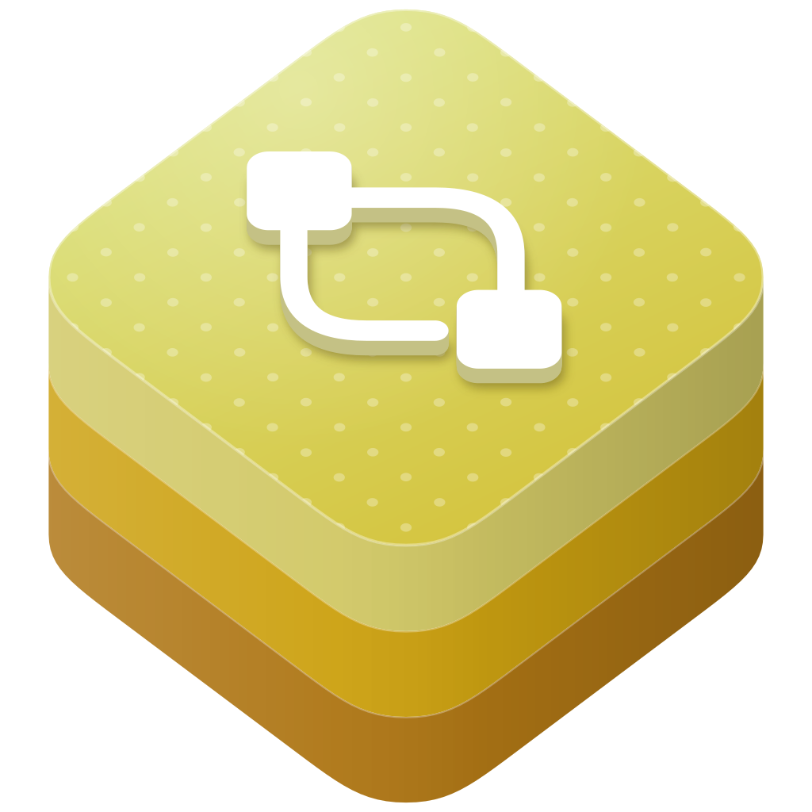
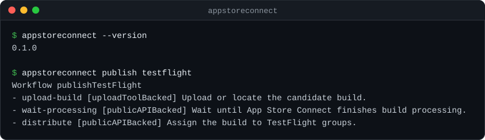

<p align="center">
  
</p>

<h1 align="center">swift-appstoreconnect</h1>

<p align="center">
  Typed App Store Connect clients, workflow plans, and command-line tools for Swift.
</p>

<p align="center">
  <a href="https://github.com/swift-library/swift-appstoreconnect/actions/workflows/ci.yml"></a>
  
  <a href="LICENSE.txt"></a>
</p>

[Overview](#overview) · [Install](#install) · [Quick start](#quick-start) ·
[CLI](#cli) · [Traits](#traits) · [Requirements](#requirements) ·
[Documentation](#documentation) · [Contributing](#contributing) · [License](#license)

> [!NOTE]
> swift-appstoreconnect is pre-1.0. Minor releases may include source-breaking
> changes, so depend on it with `.upToNextMinor(from:)`.

## Overview

Build App Store Connect integrations with typed requests, explicit credentials,
and serializable workflow plans. The Public API client is generated from the
locked Apple OpenAPI specification. Domain traits select the API surface your
application needs.

| Product | Purpose |
| --- | --- |
| `AppStoreConnectCore` | Requests, transports, JWT credentials, retries, pagination, and upload primitives. |
| `AppStoreConnectPublicAPI` | Generated typed clients and capability facades. |
| `AppStoreConnectWorkflow` | Domain commands, built-in plans, and the workflow-file runner. |
| `AppStoreConnectWebSession` | Experimental cookie inputs, providers, and JSON session storage. |
| `AppStoreConnectIrisAPI` | Experimental read-only Iris endpoint access. |
| `appstoreconnect` | Command-line interface over Workflow. |

Supported Public API commands include app and build reads, TestFlight,
signing and provisioning, review submissions, commerce, reports, and
trait-selected domain operations. Implemented CLI writes are dry-run by default.
App Store/TestFlight publishing and metadata pull/push currently produce plans;
end-to-end publishing, metadata apply, resumable media upload, live Apple Account
login, and Iris writes are unavailable. See the
[command guide](Sources/AppStoreConnectCLI/AppStoreConnectCLI.docc/CommandGuide.md)
for command-specific behavior.

## Install

Add the dependency and select the products your target imports:

```swift
dependencies: [
    .package(
        url: "https://github.com/swift-library/swift-appstoreconnect.git",
        .upToNextMinor(from: "0.1.0")
    )
],
targets: [
    .target(
        name: "YourTarget",
        dependencies: [
            .product(name: "AppStoreConnectCore", package: "swift-appstoreconnect"),
            .product(name: "AppStoreConnectPublicAPI", package: "swift-appstoreconnect"),
            .product(name: "AppStoreConnectWorkflow", package: "swift-appstoreconnect")
        ]
    )
]
```

## Quick start

Construct a typed client with an existing JWT. This example creates the client
without sending a request; replace the example token through your application's
credential input before making live calls.

```swift
import AppStoreConnectCore
import AppStoreConnectPublicAPI

let client = AppStoreConnectPublicClient(
    client: Client.appStoreConnectURLSession(
        credential: AppStoreConnectBearerToken(token: "example-token")
    )
)
let apps = client.apps
```

To sign tokens in your application, use `AppStoreConnectJWTSigningKey` with
`AppStoreConnectJWTSigner` and `AppStoreConnectCachedJWTCredential`. The key-file
loader requires an owned regular file with no group or other permissions.

Create a workflow plan without credentials or network access:

```swift
import AppStoreConnectWorkflow

let workflow = WorkflowRunner().dryRun(.publishAppStore)
let steps = workflow.steps
```

## CLI

From a source checkout, inspect the command registry and preview a workflow:

```sh
swift run appstoreconnect commands list --json
swift run appstoreconnect workflow dry-run public-release-readiness --app-id example-app
swift run appstoreconnect publish testflight --dry-run
```



Live Public API reads and supported writes use the caller-provided JWT in
`ASC_API_TOKEN`. For example, `swift run appstoreconnect apps list --limit 10`
reads apps visible to that credential. Supported mutations require `--confirm`;
plan-only commands return an unsupported result when asked to execute.

`commands list --json` distinguishes implemented commands, aliases, blocked
commands, and commands outside the package's scope. An implemented command may
provide planning only. Local Xcode archive, export, and upload commands require
macOS to execute and also require `--confirm`.

## Traits

`PublicAPIBase` is enabled by default. Disabling default traits still retains the
baseline needed by Workflow and CLI. Choose domain traits for additional typed
operations; `PublicAPIFull` enables all Public API domains and increases generated
source and compilation work. It does not enable `Experimental`.

| Trait | Additional API domain |
| --- | --- |
| `PublicAPIRelease` | Release, metadata, review, availability, and app events. |
| `PublicAPITestFlight` | Builds and TestFlight. |
| `PublicAPIMetadataMedia` | Localizations, screenshots, previews, custom product pages, and App Clips. |
| `PublicAPICommerce` | Purchases, subscriptions, prices, and offers. |
| `PublicAPIReports` | Analytics, metrics, sales, and finance reports. |
| `PublicAPISigningAccess` | Signing, provisioning, users, and access. |
| `PublicAPICloud` | Xcode Cloud and source-control integration. |
| `PublicAPIGameCenter` | Game Center. |
| `PublicAPIDistribution` | Alternative distribution, marketplaces, webhooks, and territories. |

For example, enable commerce while keeping defaults:

```sh
swift run --traits PublicAPICommerce,default appstoreconnect iap list --app example-app
```

`Experimental` is default-off. It enables WebSession, Iris, and their Workflow/CLI
paths; the WebSession and Iris products have no experimental declarations without
it. Session providers consume explicit cookie, session-file, or
browser-cookie-file input. They do not perform interactive account login.

## Requirements

Swift 6.3 or later; iOS 18, macOS 15, tvOS 18, watchOS 11, or visionOS 2 or later.
Xcode integration requires Xcode 26.4 or later. Local Xcode process execution
requires macOS. Package checks cover the default,
disabled-default, full Public API, and experimental trait configurations, plus
independent consumer builds. Simulator compilation checks deployment floors;
live API access requires your own credentials and is excluded from public CI.

## Documentation

- [API documentation](https://swift-library.github.io/swift-appstoreconnect/): module reference and usage.
- [Command guide](Sources/AppStoreConnectCLI/AppStoreConnectCLI.docc/CommandGuide.md): commands, traits, and execution boundaries.
- [Documentation index](Docs/README.md): module design and architecture.
- [Versioning and release](Documentation/Architecture/VersioningAndRelease.md): compatibility and release policy.
- [Specification lock](Vendor/AppStoreConnectOpenAPI/spec.lock.json): Apple specification source and checksums.
- [Changelog](CHANGELOG.md): release history.

## Contributing

See [CONTRIBUTING.md](CONTRIBUTING.md). Run `Scripts/check` for the complete
package checks and `Scripts/check-docs` for the six-module documentation build.
Report security issues through [SECURITY.md](SECURITY.md).

## License

Package code is licensed under [Apache-2.0 with the Swift exception](LICENSE.txt).
Apple's specification is governed separately; see [NOTICE](NOTICE) for its
ownership and applicable terms. This independent project is not affiliated with
or endorsed by Apple. App Store Connect is a trademark of Apple Inc.
